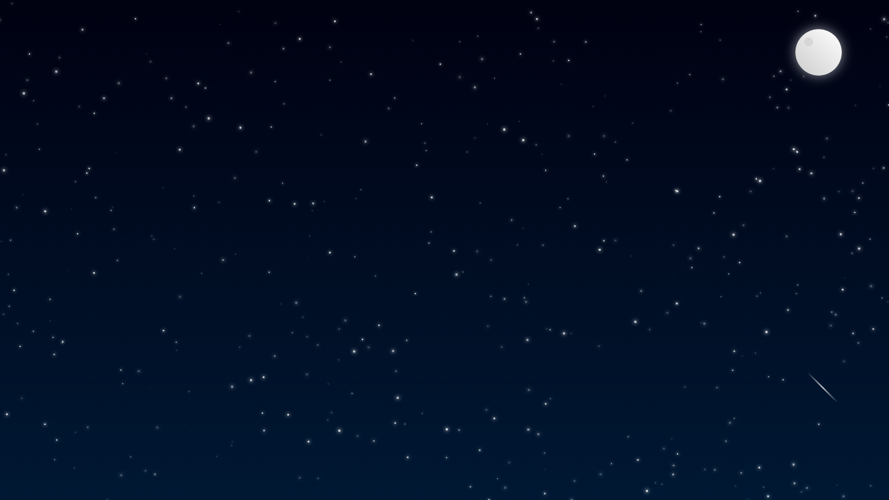

# Falling Star

This project creates a shooting star animation in the night sky using HTML, CSS, and JavaScript. It provides a simple yet visually appealing effect. ✨

## Features
- Night-themed background
- Shooting star animation
- Minimalistic and elegant design
- Responsive compatibility

## Usage
To run the project, simply open the **fallingstar.html** file in a web browser.

### Installation
1. **Clone the repository:**  
   ```bash
   git clone https://github.com/shendjs/FallingStar.git
   ```
2. **Open the project directory:**  
   ```bash
   cd FallingStar
   ```
3. **Open the HTML file in a browser**

## Screenshot


## Contributing
If you'd like to contribute, feel free to submit a **pull request** or open a new **issue**. 💡

## License
This project is licensed under the MIT License. For more details, check the `LICENSE` file.

---
